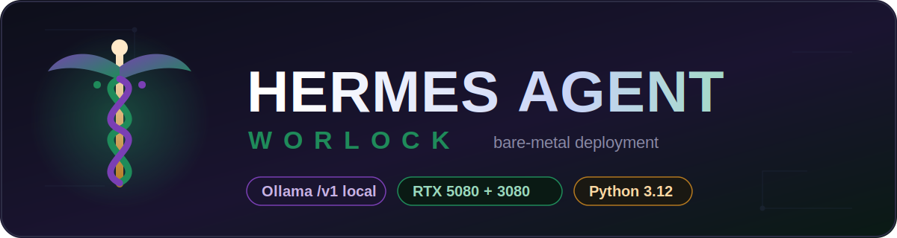
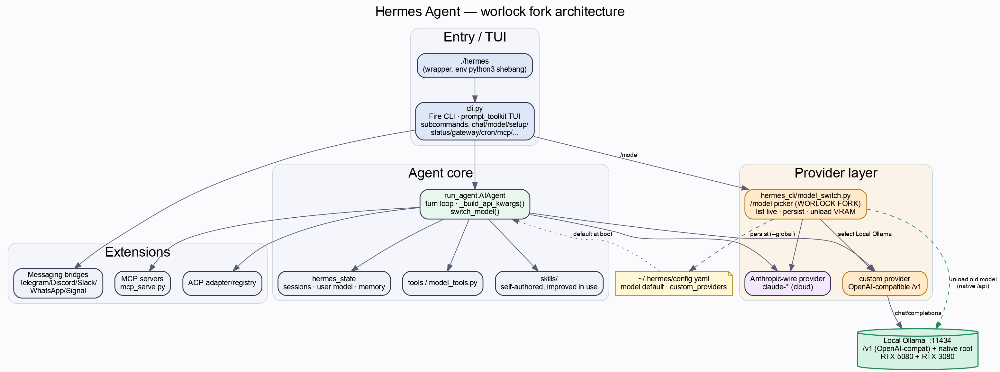
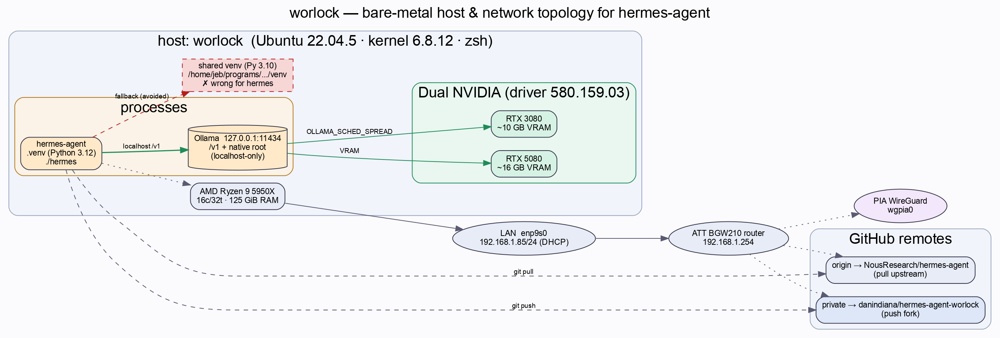
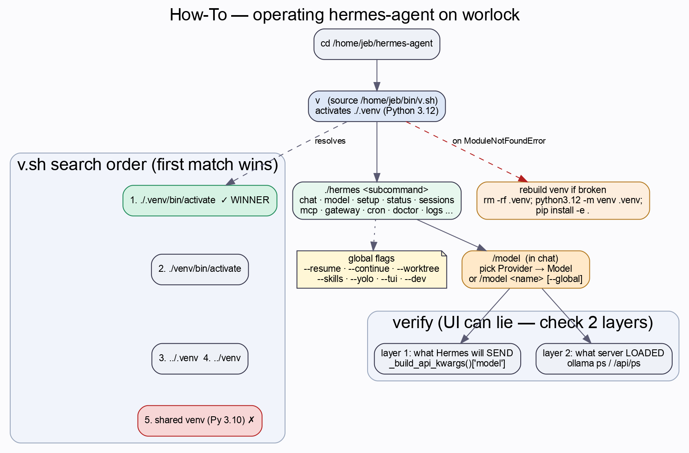
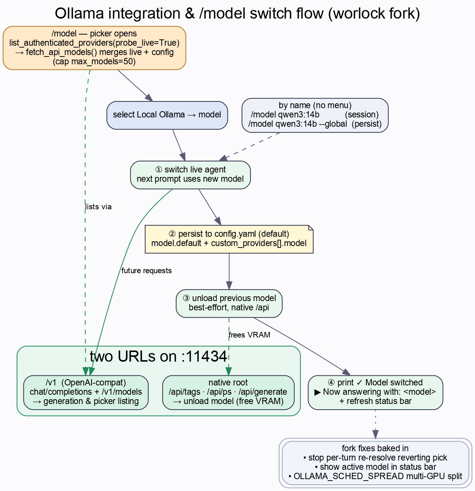
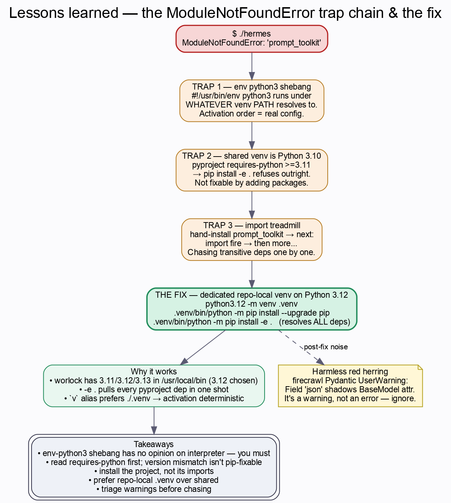
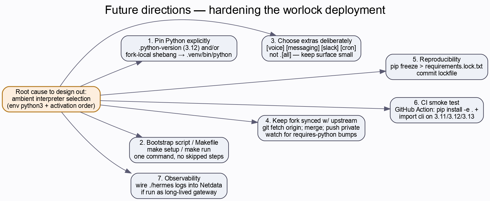
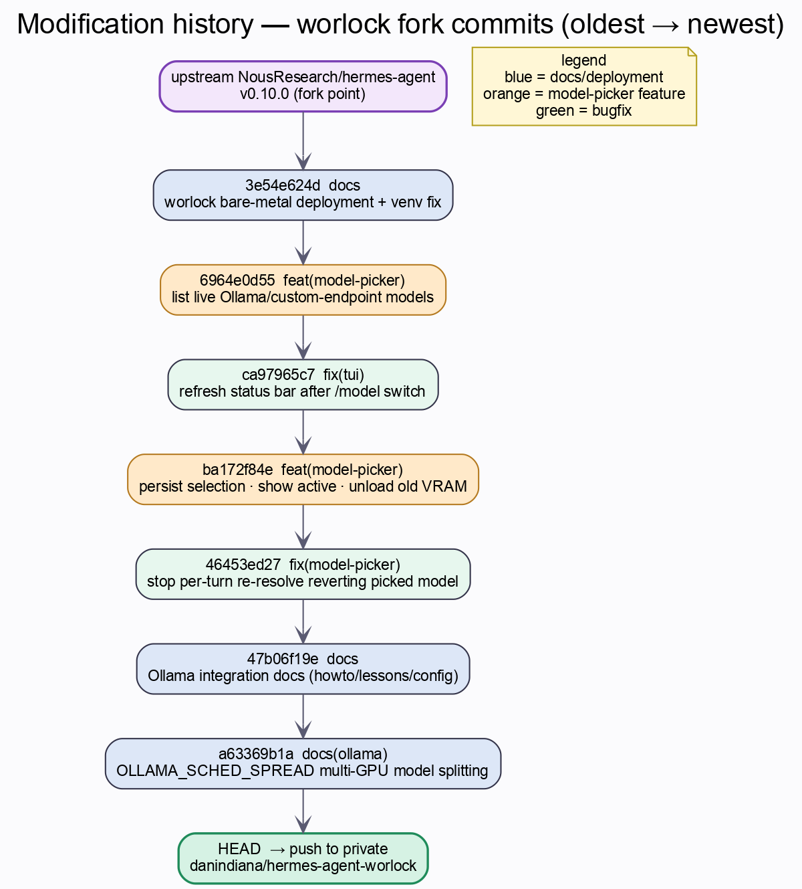

<p align="center">
  
</p>

# Hermes Agent — worlock deployment ☤

> **Public fork** of [NousResearch/hermes-agent](https://github.com/NousResearch/hermes-agent), deployed
> **bare-metal** on the host **`worlock`**. This README documents *this machine's* install — the venv fix
> that got `./hermes` running, the local **Ollama** integration, and the `/model` picker work done on top of
> upstream. The original upstream README is preserved verbatim at [`UPSTREAM_README.md`](UPSTREAM_README.md).


---

## Table of contents

1. [What is Hermes Agent?](#what-is-hermes-agent)
2. [What this fork adds](#what-this-fork-adds)
3. [Architecture](#architecture)
4. [Bare-metal host & network topology](#bare-metal-host--network-topology)
5. [TL;DR — running it on worlock](#tldr--running-it-on-worlock)
6. [How-To (operator runbook)](#how-to-operator-runbook)
7. [Ollama integration](#ollama-integration)
8. [The deployment story (why a local venv exists)](#the-deployment-story-why-a-local-venv-exists)
9. [Lessons learned](#lessons-learned)
10. [Future directions](#future-directions)
11. [Release / modification history](#release--modification-history)
12. [Troubleshooting](#troubleshooting)
13. [Companion documentation](#companion-documentation)
14. [License](#license)

---

## What is Hermes Agent?

Hermes Agent is Nous Research's self-improving AI assistant with tool-calling capabilities. It creates
skills from experience, improves them during use, searches its own past conversations, and builds a
persistent model of the user across sessions. It runs locally, in Docker, over SSH, or on serverless
backends, and can be reached from a terminal TUI or messaging platforms (Telegram, Discord, Slack,
WhatsApp, Signal). See [`UPSTREAM_README.md`](UPSTREAM_README.md) for the full feature tour and the
canonical install path.

The Python package is `hermes-agent` (version 0.10.0), launched via the `./hermes` wrapper script.

## What this fork adds

This fork is a **deployment + local-inference** layer on top of upstream. Three things:

1. **Bare-metal install that actually runs.** A dedicated Python 3.12 `.venv` resolves the
   `ModuleNotFoundError` / wrong-interpreter / `requires-python >=3.11` trap chain that blocked `./hermes`
   on worlock. See [The deployment story](#the-deployment-story-why-a-local-venv-exists).
2. **Local Ollama wired in** through Ollama's OpenAI-compatible `/v1` API — run Hermes entirely on
   worlock's dual GPUs with no cloud spend. See [Ollama integration](#ollama-integration).
3. **A reworked `/model` picker** — lists *live* Ollama models, persists the selection to `config.yaml`,
   shows the active model in the status bar, unloads the previous model from VRAM on switch, and no longer
   reverts the picked model on the next turn.

Everything is documented in the companion docs (see [the table below](#companion-documentation)).

## Architecture

How the pieces fit together — entry/TUI, the agent core, extensions (MCP/ACP/messaging), and the provider
layer where the worlock fork lives (orange = fork-specific):



- **Entry / TUI** — `./hermes` (a thin `env python3` wrapper) launches `cli.py`, a Fire-based CLI with a
  `prompt_toolkit` TUI exposing subcommands (`chat`, `model`, `setup`, `gateway`, `cron`, `mcp`, …).
- **Agent core** — `run_agent.AIAgent` runs the turn loop; `_build_api_kwargs()` assembles the outgoing
  request (the model field is what you verify after a switch), `switch_model()` changes the live model.
- **Provider layer** — requests go either to the **Anthropic-wire** provider (`claude-*`, cloud) or to a
  **`custom`** OpenAI-compatible provider. On worlock the custom provider is the local Ollama endpoint.
  `hermes_cli/model_switch.py` (the fork's `/model` picker) drives selection, persistence to
  `~/.hermes/config.yaml`, and VRAM unload.

> SVG (crisp at any zoom): [`diagrams/architecture.svg`](diagrams/architecture.svg)

## Bare-metal host & network topology

`worlock` is a Ryzen 9 5950X workstation with two NVIDIA GPUs. Ollama binds **localhost-only** on
`:11434`; Hermes reaches it over the loopback `/v1` endpoint. Git has two remotes — `origin` (pull
upstream) and `private` (push this fork).



| | |
|---|---|
| Hostname / user | `worlock` / `jeb` (NOPASSWD sudo) |
| OS / kernel / shell | Ubuntu 22.04.5 LTS / Linux 6.8.12 / zsh |
| CPU / RAM | AMD Ryzen 9 5950X (16c/32t) / 125 GiB |
| GPUs (driver 580.159.03) | RTX 5080 (~16 GB) + RTX 3080 (~10 GB) ≈ 26.5 GB VRAM |
| LAN | enp9s0 — 192.168.1.85/24 (DHCP) |
| Hermes path / venv | `/home/jeb/hermes-agent` / `./.venv` (Python 3.12) |
| Ollama | `127.0.0.1:11434` (`/v1` OpenAI-compat + native root), localhost-only |

Full hardware/OS detail: [`bare_metal_system.md`](bare_metal_system.md) ·
[`bare_metal_system_config.md`](bare_metal_system_config.md) · [`bare_metal_configs.md`](bare_metal_configs.md).

> SVG: [`diagrams/network_topology.svg`](diagrams/network_topology.svg)

## TL;DR — running it on worlock

```bash
cd /home/jeb/hermes-agent
v            # activates ./.venv (Python 3.12) via the `v` shell alias
./hermes     # launches the agent
```

If `./hermes` crashes with `ModuleNotFoundError: No module named 'prompt_toolkit'`, the local venv is not
active — see [Troubleshooting](#troubleshooting).

## How-To (operator runbook)

The everyday flow: `cd` into the repo, activate the venv with `v` (which prefers `./.venv` via `v.sh`'s
search order), run a `./hermes` subcommand, switch models with `/model`, and verify at two layers.



**Activate** — `v` is `source /home/jeb/bin/v.sh`; it sources the first venv it finds, with `./.venv` first
and the shared Python-3.10 venv last (the wrong one for hermes). On success it prints the active
interpreter.

**Run** — common subcommands:

```bash
./hermes               # default interactive chat
./hermes --help        # top-level usage and subcommands
./hermes chat          # interactive chat
./hermes model         # select default model and provider
./hermes setup         # interactive setup wizard
./hermes status        # status
./hermes sessions      # list/inspect past sessions
./hermes mcp           # MCP server management
```

Others: `gateway`, `cron`, `webhook`, `hooks`, `doctor`, `backup`, `import`, `config`, `skills`,
`plugins`, `memory`, `tools`, `dashboard`, `logs`. Global flags worth knowing: `--resume SESSION`,
`--continue [NAME]`, `--worktree`, `--skills`, `--yolo`, `--tui`, `--dev`.

**Recreate the venv** if it's broken:

```bash
rm -rf .venv && python3.12 -m venv .venv
.venv/bin/python -m pip install --upgrade pip
.venv/bin/python -m pip install -e .
```

Full runbook (extras install, dependency updates, remotes): [`howto.md`](howto.md).

> SVG: [`diagrams/howto.svg`](diagrams/howto.svg)

## Ollama integration

Hermes talks to Ollama through Ollama's **OpenAI-compatible** API. Two URLs matter: **`/v1`** for
generation and model listing, and the **native root** for unloading a model to free VRAM on switch.



`~/.hermes/config.yaml` block:

```yaml
model:
  default: qwen3.5:4b                       # whichever model is the current default
  provider: custom                          # bare "custom" = endpoint defined by base_url
  base_url: http://localhost:11434/v1       # Ollama's OpenAI-compatible endpoint (/v1 required)
  api_key: ollama                           # Ollama ignores auth; any non-empty string works
custom_providers:
- name: Local Ollama
  base_url: http://localhost:11434/v1
  api_key: ollama
  model: qwen3.5:4b                          # kept in sync with model.default by the picker
```

**Switching models** — `/model` opens the picker (Provider → Model). On selection the fork: (1) switches
the live agent, (2) **persists** to `config.yaml` by default, (3) **unloads** the previous model from VRAM,
(4) prints `✓ Model switched` / `▶ Now answering with: <model>` and refreshes the status bar. By name:
`/model qwen3:14b` (session) or `/model qwen3:14b --global` (persist). The picker caps at `max_models=50`.

For multi-GPU model splitting across the RTX 5080 + 3080, set `OLLAMA_SCHED_SPREAD` — see
[`bare_metal_configs.md`](bare_metal_configs.md). Full wiring/verify steps:
[`howto_ollama_integration.md`](howto_ollama_integration.md).

> SVG: [`diagrams/ollama_model_switch.svg`](diagrams/ollama_model_switch.svg)

## The deployment story (why a local venv exists)

Out of the box, `./hermes` uses `#!/usr/bin/env python3`, so it runs under **whatever Python is first on
`PATH`**. On worlock that defaulted to the *shared* venv at `/home/jeb/programs/python_programs/venv`,
which (1) lacked hermes's dependencies (`prompt_toolkit`, `fire`, …) and (2) was **Python 3.10**, while
hermes requires **≥ 3.11** — so it could not even `pip install -e .` the project.

The fix was a dedicated, repo-local virtual environment built on Python 3.12:

```bash
cd /home/jeb/hermes-agent
python3.12 -m venv .venv
.venv/bin/python -m pip install --upgrade pip
.venv/bin/python -m pip install -e .       # pulls all deps from pyproject.toml
```

The `v` alias searches `./.venv` **before** the shared venv, so once this `.venv` exists, `v` activates the
correct interpreter automatically. `.venv/` is gitignored and never committed.

## Lessons learned

A short post-mortem of the `ModuleNotFoundError` session, drawn as the three layered traps and the fix
that resolved all of them at once:



- **Trap 1** — `env python3` shebang runs under *whatever* venv is active; activation order is the real
  config.
- **Trap 2** — the shared venv was Python 3.10; `requires-python >=3.11` makes that a dead end no `pip
  install` can fix.
- **Trap 3** — installing one missing module just reveals the next; install *the project* (`pip install
  -e .`), not its imports one by one.
- **Red herring** — a firecrawl Pydantic `UserWarning` (`json` field shadows a `BaseModel` attr) appears
  post-fix; it's a warning, not an error — ignore it.

Full narrative: [`lessons_learned.md`](lessons_learned.md). Ollama-specific picker lessons:
[`lessons_learned_ollama.md`](lessons_learned_ollama.md).

> SVG: [`diagrams/lessons_learned.svg`](diagrams/lessons_learned.svg)

## Future directions

Hardening ideas that design out the original "wrong Python / missing deps" failure class. None are
required for day-to-day use.



Pin Python (`.python-version` / fork-local shebang) · bootstrap `Makefile` · choose extras deliberately
(`[voice]`, `[messaging]`, `[slack]`, `[cron]`) · keep the fork synced with upstream · commit a
`requirements.lock.txt` · add a CI smoke test on 3.11/3.12/3.13 · wire `./hermes logs` into worlock's
Netdata. Details: [`future_directions.md`](future_directions.md).

> SVG: [`diagrams/future_directions.svg`](diagrams/future_directions.svg)

## Release / modification history

Every change this fork makes, oldest → newest, off the upstream v0.10.0 fork point (blue = docs/deployment,
orange = model-picker feature, green = bugfix):



| # | Commit | Type | Summary |
|---|--------|------|---------|
| 1 | `3e54e624d` | docs | Document worlock bare-metal deployment + venv fix |
| 2 | `6964e0d55` | feat | `/model` picker lists live Ollama/custom-endpoint models |
| 3 | `ca97965c7` | fix | Refresh status bar after model switch from `/model` picker |
| 4 | `ba172f84e` | feat | Persist selection, show active model, unload old from VRAM |
| 5 | `46453ed27` | fix | Stop per-turn re-resolve from reverting the picked model |
| 6 | `47b06f19e` | docs | Add Ollama integration docs (howto, lessons, bare-metal config) |
| 7 | `a63369b1a` | docs | Document `OLLAMA_SCHED_SPREAD` for multi-GPU model splitting |

> SVG: [`diagrams/releases_timeline.svg`](diagrams/releases_timeline.svg)

## Troubleshooting

| Symptom | Cause | Fix |
|---------|-------|-----|
| `ModuleNotFoundError: No module named 'prompt_toolkit'` (or `fire`, etc.) | `./hermes` ran under a venv without hermes deps | Run `v` from the repo dir first, or call `.venv/bin/python ./hermes` |
| `ERROR: Package 'hermes-agent' requires a different Python: 3.10.x not in '>=3.11'` | venv built on Python 3.10 | Rebuild the venv with `python3.12 -m venv .venv` |
| `zsh: no matches found: .[voice]` | zsh globbed the extras brackets | Quote the extra: `'.[voice]'` |
| `UserWarning: Field name "json" … shadows an attribute in parent "BaseModel"` | Harmless upstream firecrawl warning | Ignore — not an error |

If unsure which interpreter is active: `which python3 && python3 --version`. Inside the repo's venv it
should report `…/hermes-agent/.venv/bin/python3` and `Python 3.12.x`.

## Companion documentation

| Doc | What's in it |
|-----|--------------|
| [`howto.md`](howto.md) | Operational runbook — activate venv, run subcommands, recreate the venv, update deps |
| [`lessons_learned.md`](lessons_learned.md) | The debugging narrative and the traps that bit us |
| [`future_directions.md`](future_directions.md) | Hardening ideas — pin Python, bootstrap script, extras, upstream sync |
| [`bare_metal_system.md`](bare_metal_system.md) | Host hardware/OS/network overview for worlock |
| [`bare_metal_system_config.md`](bare_metal_system_config.md) | Concrete config: paths, Python versions, `v.sh`, services |
| [`howto_ollama_integration.md`](howto_ollama_integration.md) | Wiring Ollama into Hermes — pick/switch models, verify, troubleshoot |
| [`lessons_learned_ollama.md`](lessons_learned_ollama.md) | Why the `/model` picker bugs existed and how they were fixed |
| [`bare_metal_configs.md`](bare_metal_configs.md) | Ollama service + Hermes model config values for worlock |
| [`UPSTREAM_README.md`](UPSTREAM_README.md) | The original NousResearch README, unmodified |
| [`diagrams/`](diagrams/) | Graphviz `.dot` sources + rendered `.png`/`.svg` for every diagram above |

## License

MIT, inherited from upstream. See [`LICENSE`](LICENSE).
